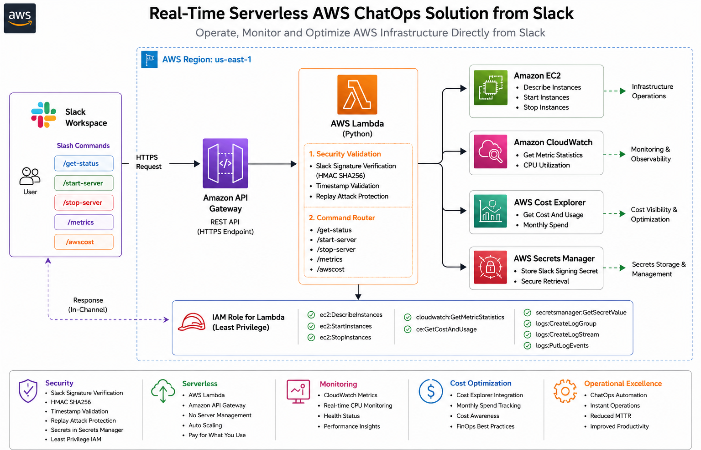
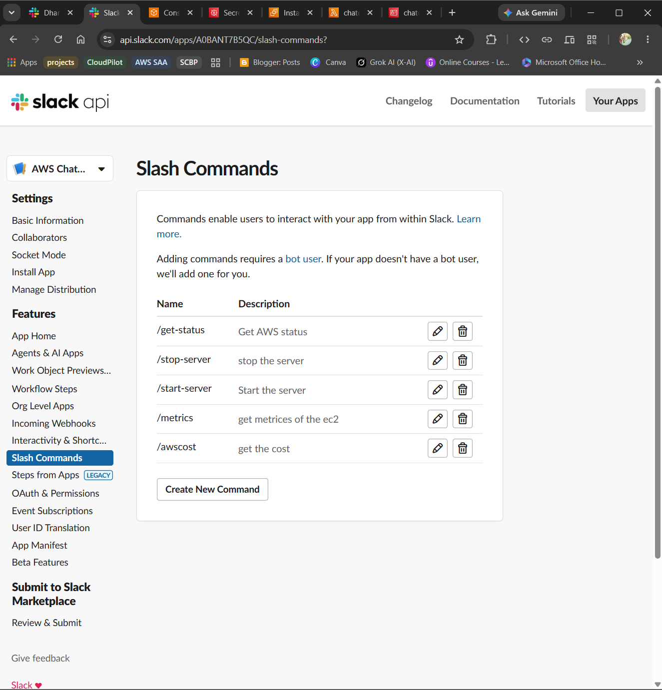
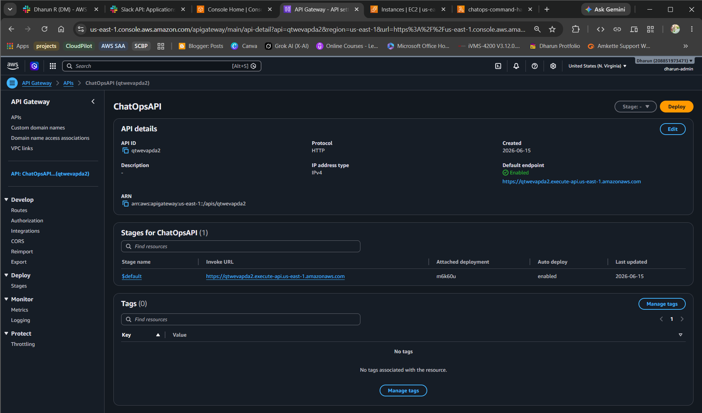
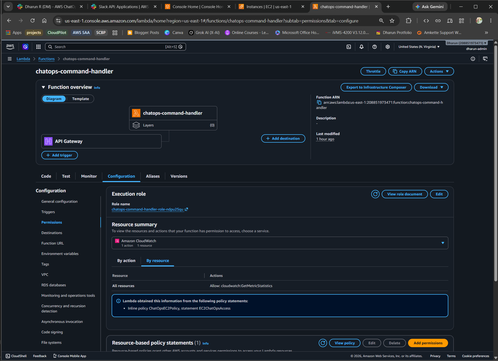
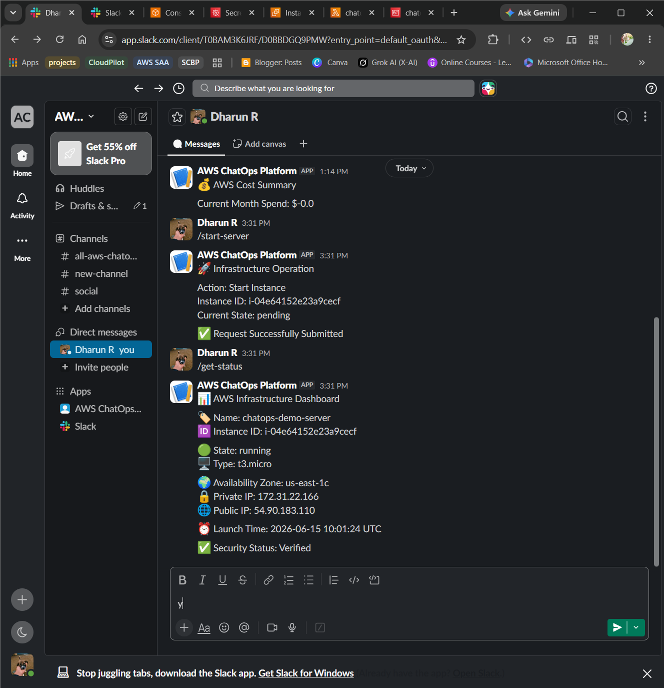
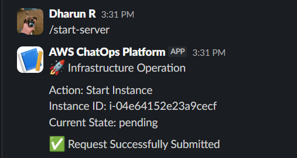
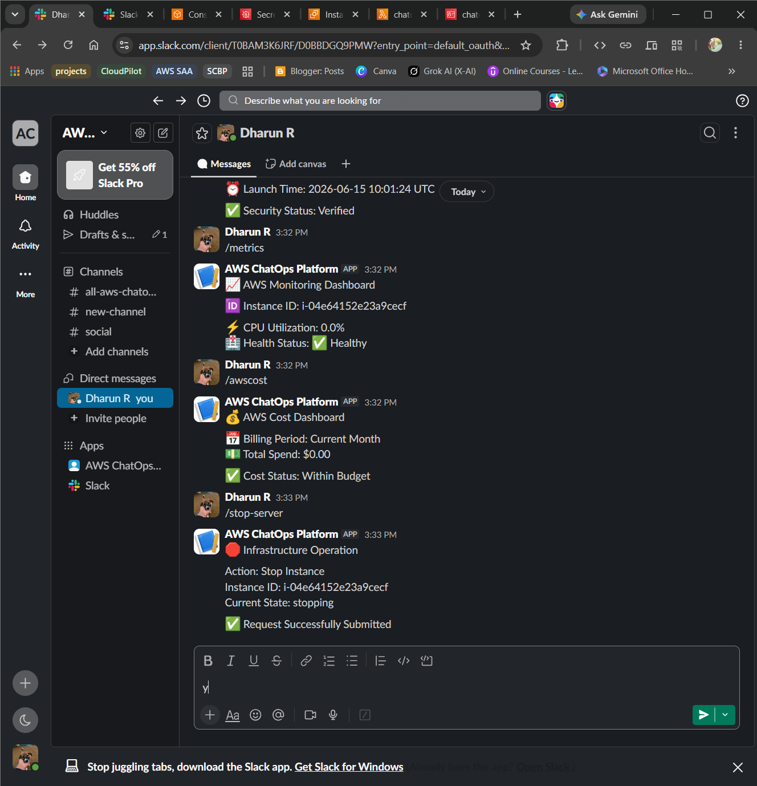
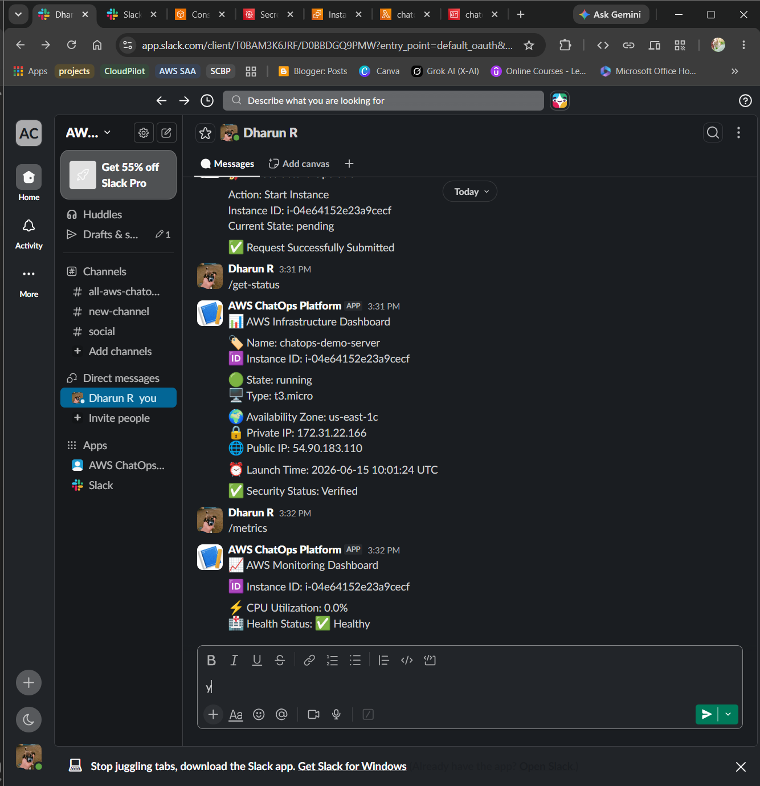
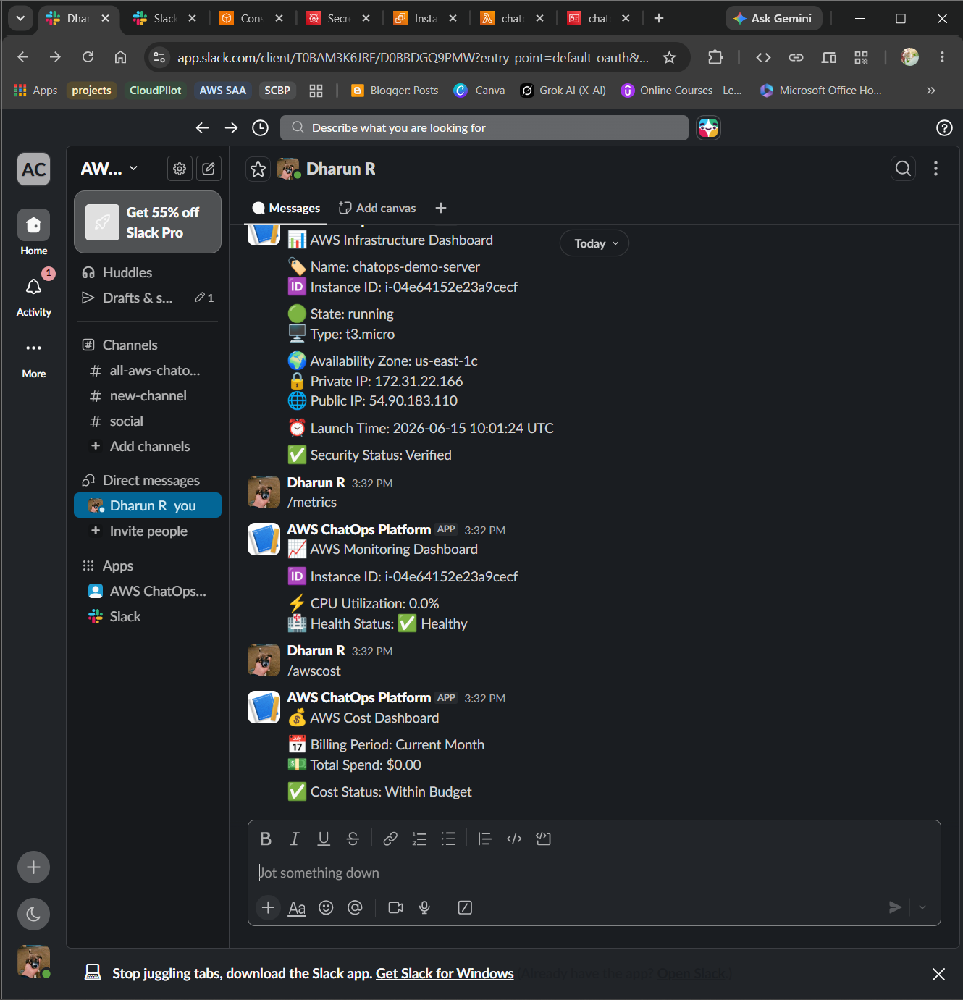
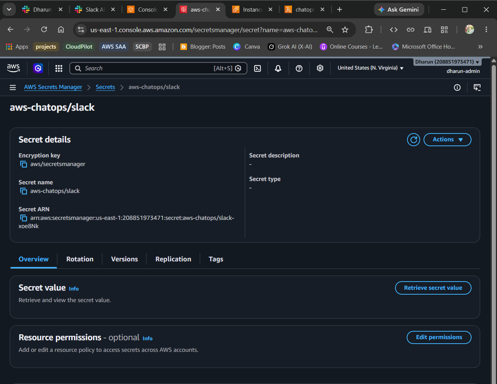

<div align="center">

# 🚀 Real-Time Serverless AWS ChatOps Solution from Slack

### Serverless Cloud Operations & Monitoring on AWS Using Slack

[](https://aws.amazon.com/)
[](https://aws.amazon.com/lambda/)
[](https://aws.amazon.com/api-gateway/)
[](https://slack.com/)
[](https://www.python.org/)

**A production-style serverless ChatOps solution that enables real-time AWS infrastructure operations, monitoring, cost visibility, and security validation directly from Slack.**

</div>

---

# 🏆 What This Project Demonstrates

This project was built to demonstrate real-world AWS cloud operations and serverless engineering practices using ChatOps principles.

| Skill Area             | What I Built                                                         |
| ---------------------- | -------------------------------------------------------------------- |
| ☁️ AWS Architecture    | API Gateway, Lambda, EC2, CloudWatch, Cost Explorer, Secrets Manager |
| ⚡ Serverless Computing | Event-driven architecture using Lambda                               |
| 🤖 ChatOps             | Infrastructure operations directly from Slack                        |
| 📊 Monitoring          | CloudWatch metrics and infrastructure health visibility              |
| 💰 Cost Optimization   | AWS Cost Explorer integration                                        |
| 🔒 Security            | Slack Signature Validation, HMAC Verification, Secrets Manager       |
| 🛡️ IAM                | Least Privilege access model                                         |

---

# ☁️ Cloud Architecture

<p align="center">
  
</p>

The architecture follows a serverless event-driven model where Slack commands trigger AWS operations through API Gateway and Lambda.

Key design decisions:

* Serverless backend using AWS Lambda
* Slack Signature Verification using HMAC SHA256
* Secrets stored securely in AWS Secrets Manager
* Least Privilege IAM permissions
* Direct integration with EC2, CloudWatch, and Cost Explorer
* Replay attack protection using timestamp validation

---

# 🔄 Solution Flow

Every Slack command follows this workflow:

```text
Slack User
    │
    ▼
Slack Slash Command
    │
    ▼
API Gateway
    │
    ▼
AWS Lambda
    │
    ├── Verify Slack Signature
    ├── Validate Timestamp
    ├── Route Command
    │
    ├── EC2
    ├── CloudWatch
    ├── Cost Explorer
    └── Secrets Manager
    │
    ▼
Response Returned to Slack
```

---

# 🛠️ Tech Stack

| Category        | Tools               |
| --------------- | ------------------- |
| ChatOps         | Slack               |
| Serverless      | AWS Lambda          |
| API Layer       | Amazon API Gateway  |
| Infrastructure  | Amazon EC2          |
| Monitoring      | Amazon CloudWatch   |
| Cost Governance | AWS Cost Explorer   |
| Security        | AWS Secrets Manager |
| Access Control  | AWS IAM             |
| Language        | Python              |
| SDK             | Boto3               |

---

# 📁 Repository Structure

```text
real-time-serverless-aws-chatops-solution/
│
├── lambda_function.py
│
├── screenshots/
│   ├── architecture-diagram.png
│   ├── slack-commands-overview.png
│   ├── slack-get-status.png
│   ├── slack-start-server.png
│   ├── slack-stop-server.png
│   ├── slack-metrics.png
│   ├── slack-awscost.png
│   ├── api-gateway-configuration.png
│   ├── lambda-function-overview.png
│   └── security-components.png
│
├── README.md
└── LICENSE
```

---

# 📖 Implementation Walkthrough

## Step 1 — Create Slack ChatOps Application

A custom Slack application was created with slash commands configured to invoke API Gateway endpoints.

Supported commands:

```text
/get-status
/start-server
/stop-server
/metrics
/awscost
```

<p align="center">
  
</p>

---

## Step 2 — Build Serverless Backend

Amazon API Gateway exposes a secure HTTPS endpoint that receives requests from Slack and forwards them to AWS Lambda.

Responsibilities:

* Receive Slack requests
* Trigger Lambda execution
* Return command responses

<p align="center">
  
</p>

---

## Step 3 — Implement Command Processing Engine

AWS Lambda serves as the central command router.

Supported operations:

```text
/get-status
/start-server
/stop-server
/metrics
/awscost
```

The Lambda function integrates directly with AWS services through Boto3.

<p align="center">
  
</p>

---

## Step 4 — Infrastructure Operations

The solution enables direct EC2 lifecycle management from Slack.

Commands:

```text
/start-server
/stop-server
/get-status
```

Capabilities:

* Retrieve instance details
* Start EC2 instances
* Stop EC2 instances
* Display infrastructure status dashboard

<p align="center">
  
</p>

<p align="center">
  
</p>

<p align="center">
  
</p>

---

## Step 5 — Monitoring & Observability

Amazon CloudWatch provides infrastructure visibility directly inside Slack.

Metrics retrieved:

* CPU Utilization
* Instance Health Status

<p align="center">
  
</p>

---

## Step 6 — Cost Governance

AWS Cost Explorer was integrated to provide real-time cost awareness.

Command:

```text
/awscost
```

Capabilities:

* Current month AWS spend
* Cost visibility from Slack
* FinOps awareness

<p align="center">
  
</p>

---

## Step 7 — Security Hardening

Security was implemented using multiple layers.

Features:

* Slack Signing Secret Validation
* HMAC SHA256 Signature Verification
* Replay Attack Protection
* AWS Secrets Manager Integration
* Least Privilege IAM Policies

<p align="center">
  
</p>

---

# 🔐 Security Architecture

| Control                    | Purpose                              |
| -------------------------- | ------------------------------------ |
| Slack Signature Validation | Verify requests originate from Slack |
| HMAC SHA256                | Validate request integrity           |
| Timestamp Validation       | Prevent replay attacks               |
| Secrets Manager            | Secure credential storage            |
| IAM Least Privilege        | Restrict AWS permissions             |

---

# 📊 AWS Services Used

| Service         | Purpose                   |
| --------------- | ------------------------- |
| API Gateway     | Public HTTPS endpoint     |
| Lambda          | Command processing engine |
| EC2             | Infrastructure operations |
| CloudWatch      | Monitoring and metrics    |
| Cost Explorer   | Cost reporting            |
| Secrets Manager | Secret management         |
| IAM             | Access control            |

---

# 🧠 AWS Architecture Decisions

| Decision                   | Why                                    |
| -------------------------- | -------------------------------------- |
| Serverless backend         | No infrastructure management overhead  |
| Slack as ChatOps interface | Fast operational workflow              |
| Lambda as command router   | Event-driven architecture              |
| Secrets Manager            | No hardcoded secrets                   |
| Signature validation       | Ensure trusted requests only           |
| Cost Explorer integration  | Promote cost visibility                |
| CloudWatch integration     | Real-time infrastructure observability |

---

# 💼 Skills Demonstrated

**AWS Cloud Services**

`AWS Lambda` `API Gateway` `EC2` `CloudWatch` `Cost Explorer` `Secrets Manager` `IAM`

**Cloud Operations**

`Infrastructure Automation` `ChatOps` `Serverless Architecture` `Monitoring` `Operational Excellence`

**Security**

`HMAC Authentication` `Signature Verification` `Replay Attack Protection` `Least Privilege IAM`

**Development**

`Python` `Boto3` `REST APIs` `Event-Driven Design`

---

<div align="center">

*Built end-to-end on AWS to demonstrate serverless architecture, cloud operations automation, monitoring, cost governance, and secure ChatOps workflows.*

</div>

# 👨‍💻 Author

**Dharun R**

**🚀 Real-Time Serverless AWS ChatOps Solution from Slack**
